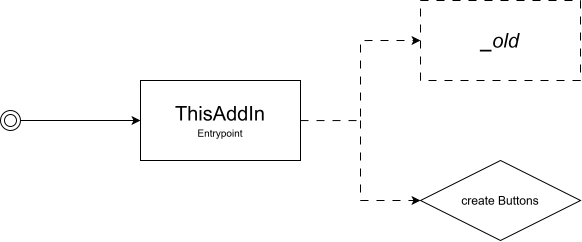
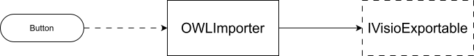
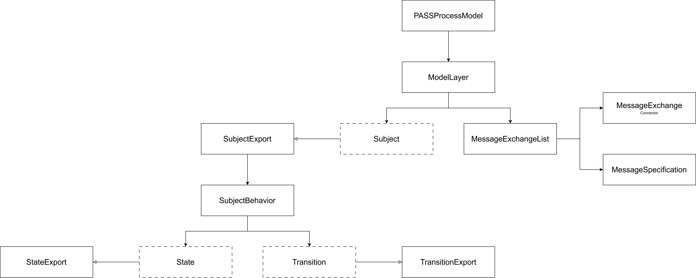

# Hallo
... und herzlich Willkommen im Visio ALPS AddIn Repository!

## Aufbau
Damit dein Start *etwas* leichter als meiner ist, erkläre ich dir,
wie das AddIn aufgebaut ist und funktioniert.

### Entrypoint

Beim Start wird `ThisAddIn#ThisAddIn_Startup` ausgeführt. Das startet vor allem den Layer Explorer und den Snap Handler -
deren Code ist allerdings alt, nicht refactored und auch nicht so schön... daher im Ordner `_old`. Die Funktionen sind
trotzdem wichtig und sollen auch noch ordentlich implementiert werden.

Außerdem werden die Buttons erzeugt, siehe dazu `ALPSRibbon`.

### Importer

Der Importer wird dann aufgerufen, wenn der `Import OWL`-Button gedrückt und eine Datei ausgewählt wurde. Der
API-Parser liest die ganze Datei ein und lädt alle darin definierten Modelle; der Importer startet anschließend
das Exportieren (ja die Bennung ist manchmal verwirrend) des ersten Modells nach Visio.

(Randbemerkung: Der Importer beachtet nur das erste Modell, da sowieso so gut wie nie mehrere Modelle in einer Datei sind.
Man könnte die weitere Funktionalität aber noch später hinzufügen.)

### Modell

Bestensfalls könnte man die Codestruktur durch mehrfaches Vererben vereinfachen, aber wir sind leider wegen Visio gezwungen,
in dieser veralteten C#-Version zu bleiben. Es sei ebenfalls erwähnt, dass die Diagramme nicht den üblichen Konventionen
entsprechen, sondern lediglich einen Ansatz zur Orientierung im Code liefern sollen.

Jedes Modell enthält Layer. Sind es mehr als `1`, so ist das ein Feature von ALPS (gegenüber PASS).

Layer enthalten Subjekte und Nachrichten; letztere sind dabei in der API als Nachrichten-Liste in den Verbinder und die
Nachrichten aufgeteilt. Über die Umsetzung in Visio reden wir lieber nicht...

Subjekte können vielerlei verschiedener Art sein. Das einzige, welches fast vollständig implementiert ist, ist das
`FullySpecifiedSubject`.

Subjekte exportieren sich selber über eine Hilfsklasse, `SubjectExport`. Diese erzeugt dann wiederum das SubjectBehavior,
welches Zustände und Transitionen enthält (welche wiederum ihre eigenen Hilfsklassen zum Export haben).

### Konstanten und Hilfsklassen
`Constants` enthält (nicht) alle Konstanten, die für die Visio-Implementierung notwendig sind. Die alte (mehr, aber auch
nicht ganz vollständige) Version ist `ALPSConstants` zusammen mit `ALPSGlobalFunctions`; eine offene Aufgabe ist noch,
alle (auch nicht aktuell benötigten) Konstanten in die neue Struktur sinnvoll zu übertragen.

`VisioHelper` enthält viele Hilfsmethoden für die Visio-Implementierung. Der Code ist aber aktuell ein riesen Chaos und
muss dringend überarbeitet werden! `ShapeFinder` ist für das Finden der Stencils zuständig, siehe auch
`VisioHelper#openStencil`.

## nächste Schritte
Jetzt da du dich hoffentlich in angemessenerer Zeit einarbeiten konntest, kommen die nächsten Aufgaben auf dich zu.

### Probleme
- Strings müssen escaped werden, bevor sie über `VisioHelper` als Property gesetzt werden: Es gab z.B. ein Problem, wenn
ein Label von `GetEnglishLabel` in `PASSProcessModelElementExport` Anführungszeichen (`"`) enthält.

### Aufgaben
- Aktuell crasht das AddIn, wenn ein Name (z.B. einer Seite) bereits existiert. (Siehe TODO in `VisioHelper.cs`, Zeile 242.)
Zum Testen muss auf den Prompt des VBA-Makros mit **Nein** geantwortet werden.
- Das Anordnen **ohne** Koordinaten ist aktuell nicht implementiert. Die Vorbedingung existiert:
`IVisioExportableWithShape#PrepareDimensions` gibt `false` zurück, wenn keine Koordinaten existieren. Ein Ansatz für einen
Algorithmus findet sich in den Branches `main` und `development`; im Branch `rewrite` wurde dieser zwecks Übersicht zunächst
nicht übernommen.
- Dokumentation ist teilweise unvollständig oder fehlt komplett. Ein einheitliches Schema wäre von Vorteil - ich habe
bisher die JavaDoc Konventionen übernommen. Inline-Kommentare sollten reduziert werden und nur für die aktive Entwicklung
(z.B. Notiz von Aufgaben) benutzt werden. Nur in Ausnahmefällen dürfen einzelne Zeilen mit einem Kommentar erklärt werden;
im Allgemeinen ist sprechender Code besser.
- `Constants` sollte vervollständigt und aufgeräumt werden. Auch `VisioHelper` muss überarbeitet werden: Das Setzen von
Eigenschaften u.ä. sollte einheitlich sein (d.h. alle Eigenschaften sollten auf dieselbe Art und Weise gesetzt werden)
und bei der Erzeugung von neuen Seiten sollte kein Fehler aufgrund des Namens auftreten können.

## offene Aufgaben
- Die API stimmt nicht immer mit der Ontologie überein. Daher können manche Features aktuell nicht implementiert werden.
Eine Dokumentation der API wäre sehr von Vorteil.
	- Subjekte: `hasSubjectExecutionMapping` wird nur für `FullySpecifiedSubject` implementiert.
	- Bei manchen Eigenschaften habe ich einen Kommentar `// alps.net.api` dazugeschrieben, diese habe ich zwar nicht
gefunden, konnte aber auch nicht verifizieren, dass sie nicht in der API existieren.
- Alle Eigenschaften aus der Ontologie sollten implementiert werden.
- Der Code in `_old` ist nur aus dem alten Projekt kopiert und umbenannt. Er funktioniert, aber ist kaum lesbar.

## Empfehlungen und persönliche Hinweise
Ich habe im Laufe meiner Entwicklung mehrere *Mini-Dokumentationen* geschrieben, diese habe ich alle mit in den `docs`
Ordner im Wurzelordner gelegt. (`documentation.md`, `combined-onts.notes`, `Data in ShapeSheet.md`) Ebenfalls beigefügt ist
eine Syntax-Highlight Erweiterung für VSCodium (wahrscheinlich auch VSCode) für die `.notes` Datei.

Protégé ist manchmal etwas komisch, dennoch hilft der Reasoner sehr gut dabei, die Ontologie zu verstehen.

Dein Computer ist nicht langsam, das ist Visio.

Die nächsten Dateien, an denen ich arbeiten wollte waren: `SubjectExport`, `StateExport`, `TransitionExport` und
`SubjectBehavior`. Alle anderen sollten eigentlich soweit fertig implementiert sein (wobei ja wie oben erwähnt, neuerdings
das Anordnen nicht mehr funktioniert).

Ich habe mal noch die OWL-Datei in den `docs` Ordner hinzugefügt, die ich immer zum Testen benutzt habe:
`[Test]_Vacation_Request_2D.owl`. Die Variante ohne Koordinaten (`[Test]_Vacation_Request.owl`) ist auch dabei, funktioniert
aber wie oben gesagt aktuell nicht.

---

Falls du mehr Fragen hast: Irgendwer (@MatthesElstermann) hat bestimmt meinen Kontakt.

Ansonsten wünsche ich frohes Entwickeln! :D