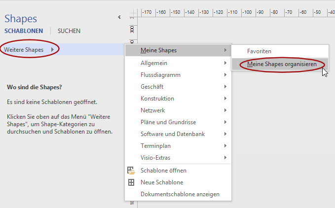

# Publish and install instructions

## Publish with visual studio

Open the project in visual studio.

Right click on your project, select "Eigenschaften". 

Go to the "Signierung" Tab and verify the expiration date of the certificate ("Ablaufdatum").

If the certificate has expired, go to the projects folder and delete the file `VisioAddIn1\SBPM-AddIn_TemporaryKey.pfx`. 
Then back in visual studio select "Testzertifikat erstellen...". Packaging the add-in
using an expired certificate will not work.

If you are going to commit the published version into the git tree, do not use a password or 
at least document the password, else you are free to use a password.

Make sure to save the project file (e.g. ctrl+s).

Then switch to the "Veröffentlichen" tab. Select a destination path. 
If you are publishing to the git tree, use `VisioAddIn1\publish` inside the projects folder. 
Note down the version information and use this to correctly tag the git commit.

If you created a new certificate visual studio will ask if the application should be overwritten. 

When the compiling has finished, copy the published setup folder to the destination PC.

If you want to commit the published folder into git, make sure to include the certificate
and the `publish` folder, including the new version specific sub-folder inside 
`publish\Application Files`.

# Installation

Execute the file `setup.exe` from the published setup folder. You can publish this folder 
yourself with visual studio or download the git tree from gitlab and use the sub-folder
`VisioAddIn1\publish` inside the git.

Once installed, open visio. The plug in should be loaded at startup.

If an error message about the SID and SBD shapes pops up, install the correct version 
of the PASS shapes. The version number is hard coded into the plugin to assure 
correct behavior. 

Click "Weitere Shapes", select "Meine Shapes" and click on "Meine Shapes organisieren".
This will open up a file explorer window. Drop the correct shapes files there. 
Then restart visio.

